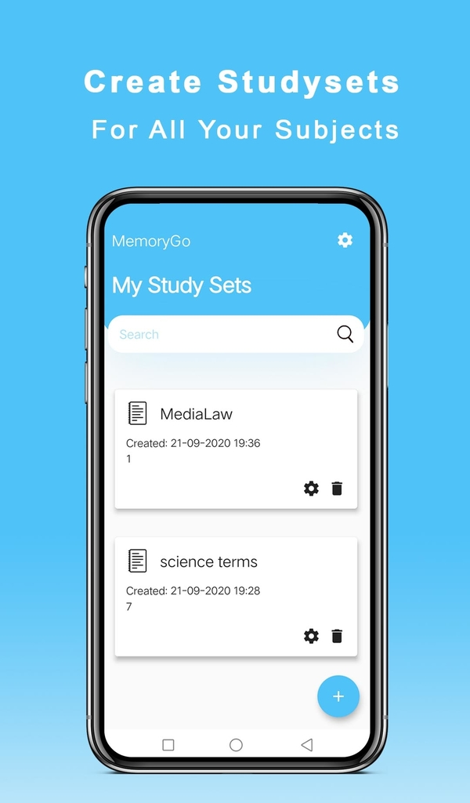
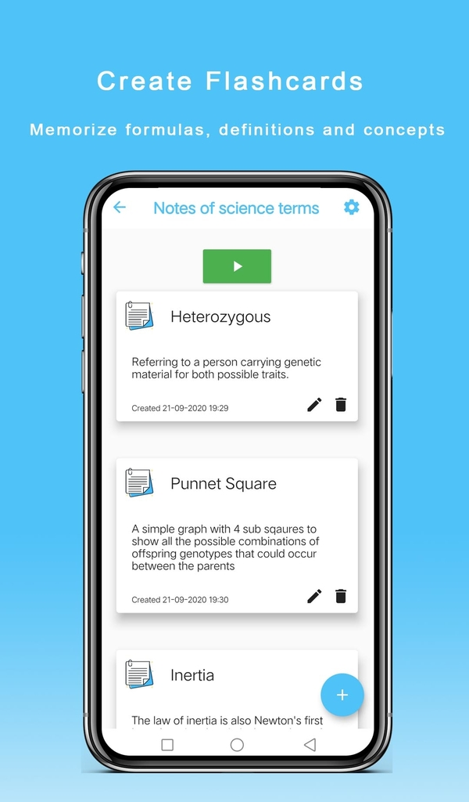
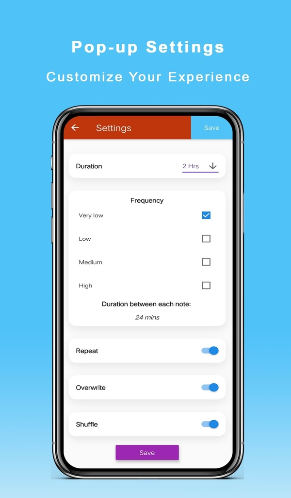
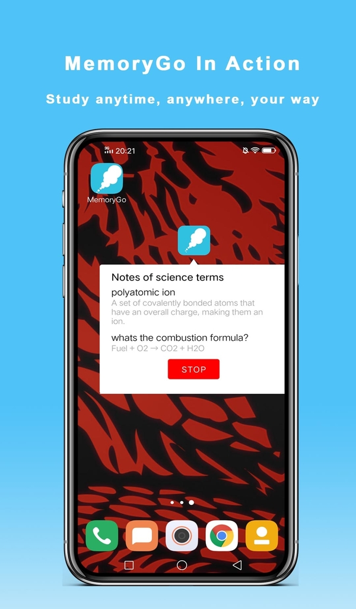
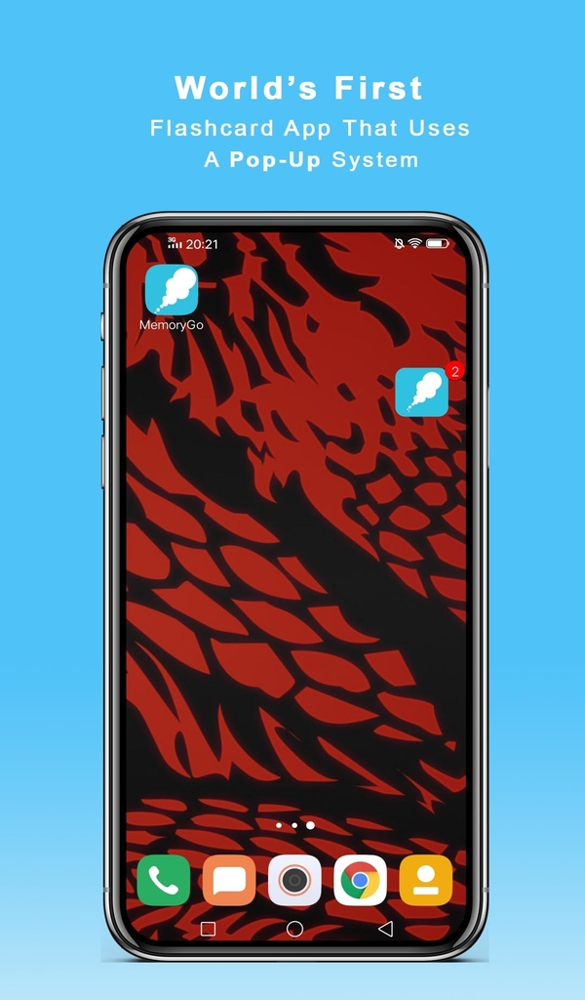

# MemoryGo
A Mobile Application (iOS and Android) created using the Flutter framework, Developed by Abdullah Mohamed. Credits to Hudson Pu for the idea!

# TLDR 

 * A cross platform mobile application for helping you study while multitasking!
 * This app was created using the Flutter framework using Dart, and specialized using Android (Java) code for the Android app on the Google Playstore (linked below)
 * Utilized Java to create multithreaded asynchronous tasks for seamless multitasking
 * Leveraged SQLite database for offline, local usage (no internet required!)

<table>
 <tr>
  <td valign="top"></td>
  <td valign="top"></td>
  <td valign="top"></td>
  <td valign="top"></td>
  <td valign="top"></td>
 </tr>
</table>

### Try it out yourself! https://play.google.com/store/apps/details?id=com.ceruleansource.MemoryGo

###### Here's a Demo Video: https://www.youtube.com/watch?v=ipWID-tdo-I
###### Here's a Promotional Video: https://www.youtube.com/watch?v=9aQ1SX-1k_o
###### Check out our LinkedIn page: https://www.linkedin.com/company/memorygo

# Technical Design

### Built With

 * Dart
 * Flutter
 * Java (Android)
 * XML
 * SQL (SQLite)
 * Gradle
 * Android Studio

### Techincal Description

 This mobile application was built using Flutter, a cross-platform framework that allows you to develop applications for both iOS and Android devices with 1 application. The Flutter application had the ability to create, edit, and delete study sets and cards that user could then use to study from at a later point. This Flutter application was specialized for Android using Method Channels, so that the user could multitask while studying! The specialized Android code made it so that the user could pick a study set, adjust the settings so that the recurrence, duration, repetition, among other options were available to customize their learning experience. Then, when the user went to press start, a background service would start on the Android device and the user would be able to roam through their apps or turn their phone off. After every specified interval of time, the user would receive a notification and a bubble would pop up on their screen, which would then display the certain notes within their study set.
 

# General Description of the Application

Ever struggled to study for a test where you just can't remember anything you studied? A vocabulary word, a definition, a Biology term, a Physics definition that you just can’t remember?

Or how about being too BUSY to study? (we get it, you have a social life too!)

MemoryGo is a flashcard tool that lets you study without realization while you play games, surf the internet, watch a video, chat with friends or any other task. Using our innovative popup/notification system specifically designed for multitasking, all you need to do is create a study set for a test, press play, and let MemoryGo work its magic!

MemoryGo uses a PROVEN study method called “Rote Learning” (Learning by repetition).

**MemoryGo allows users to:**
* Create, edit, and delete study sets and cards
* Set Theme colours
* Control the recurrence, duration, repeat and overwrite for a customized learning experience

The app is still at early stages of development and will be monitored/updated for advancement purposes. We would love to hear feedback, ideas and constructive criticism from you so we could improve your overall experience.

*Library Credits:*

Quick thanks to the following libraries for making this app possible:
Notification Badges -> nex3z,
Chat bubble -> txusballesteros
